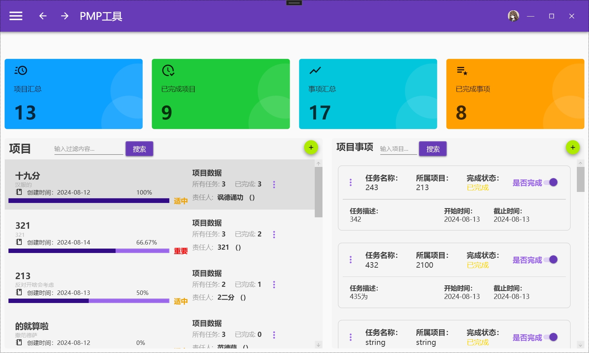
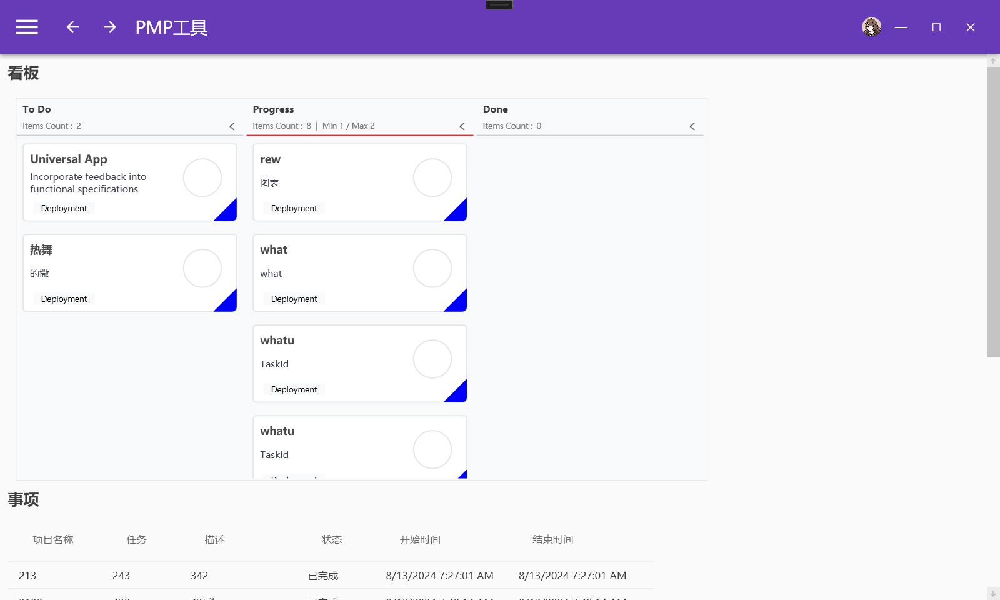
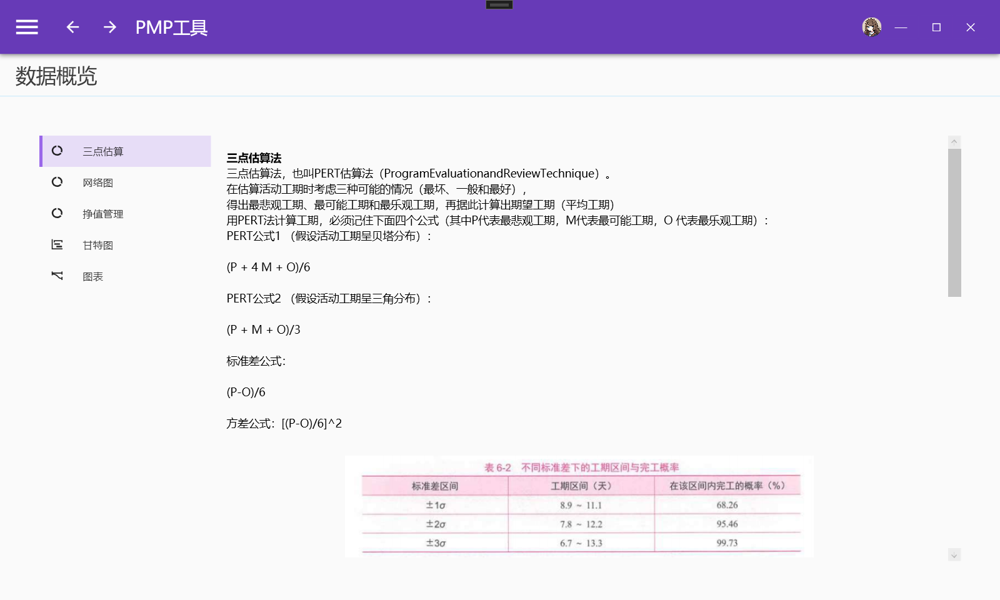
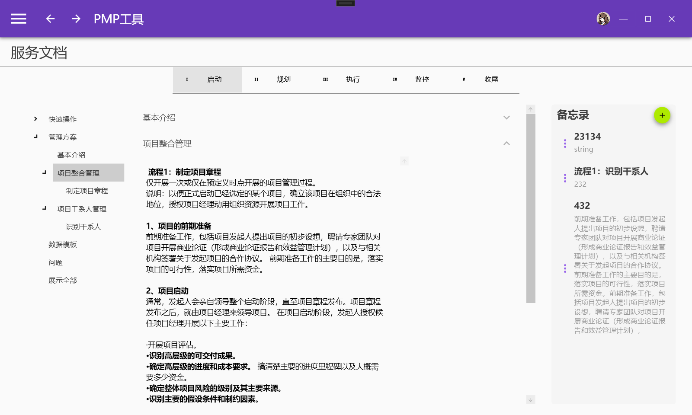

# pm
### 项目概述
本项目是使用.net core WPF开发的，基于Prison的mvvm框架进行搭建的。 本应用程序只设置在windows上运行，未开展安卓和其他平台上的开发。 本项目是用于对项目管理知识pmp的一次工具性的实践，旨在把pmp项目管理知识，能够指导和帮助人们更加清晰快速对项目和事项的管理。

### 致谢
首先在此感谢在实习期间对我耐心提供指导意见的李导师和唐经理，以及中集领导们的关心与支持。

### 参考书籍
* 汪博士解读P M P 考试/ 汪小金著. 一5 版. 一北京：电子工业出版社，2 0 1 8 . 2
ISBN978-7-121-33321-7
* 风险管理 相关的（ITTO）输入、工具与技术_风险管理的itto-CSDN博客
* 项目管理-5大过程组-10大知识领域-47过程_项目5大过程组-CSDN博客

### 开源项目感谢
感谢在开发过程中的开源项目提供的框架性支持， 使用的应用基础项目为B站痕迹gg提供的教程
https://www.bilibili.com/video/BV1nY411a7T8

开源网址：https://github.com/HenJigg
B站up主龙马项目提供以及b站的视频教学

开源网址：https://github.com/liqiang80425/DailyApp

https://www.bilibili.com/video/BV1sz42197wz

### 特别感谢
在此特别感谢以下所运用到的源和命名空间库，开源项目的使用:
* Syncfusion :
.NET, Xamarin, JavaScript, Angular UI components | Syncfusion
https://www.syncfusion.com/

* AIStudio框架：
https://gitee.com/akwkevin/aistudio.-introduce#https://gitee.com/akwkevin/aistudio.-wpf.-diagram

### 联系方式
软件有问题请联系，后续有机会再进行更新。

### 用户界面设计和布局方案
#### 导航栏
所有页面左上角均包含导航栏，提供全局导航功能。正文部分包含导航日志的切换功能，方便用户在不同页面间快速切换。

#### 项目页
##### 页面布局
上部显示项目汇总和已完成项目，以及事项汇总和已完成事项的四个板块。下方内容分为左右两部分，分别展示项目和项目事项的总内容表。

##### 功能实现
* 项目过滤：通过搜索项目标题进行模糊搜索。
* 项目卡片：每个项目卡片包含项目标题、描述、创建时间、完成百分比、重要程度、责任人、所有任务数和已完成任务数，实现增删改查功能。
* 项目事项卡片：包含任务名称、所属项目、完成状态、任务描述、开始和结束时间，以及完成按钮，同样实现增删改查功能。
* 搜索功能：在项目事项中，通过搜索所属项目的标题找到相关项目事项。

#### 事项页
##### 页面布局
上部为看板，下部为事项具体内容。

##### 功能实现
* 看板：数据绑定事项，分为未开始、进行中和已完成三个部分。看板可以调整项目位置，但未实现数据库内容的同步更新。
* 事项具体内容：包含事项基本信息，格式由ListView组成。

#### 数据概览页
##### 页面布局
包含3点估算、网络图、挣值管理、甘特图和图表五个部分。

##### 功能实现
* 3点估算：通过添加活动名称和工期进行估算，右侧显示结果。
* 网络图和挣值管理：提供功能提示和案例提示，无实际计算功能。

#### 服务文档页
##### 页面布局
包含启动、规划、执行、监控和收尾五个过程组。

##### 功能实现
* 文档内容：包括快速操作管理方案、数据模板、问题和展示全部。
* 个性化记录：右侧备忘录功能，支持增删改查。

#### 设置页面
包含调色板、账号信息和关于软件的信息。

### 安装包使用
安装包直接安装即可，安装包为试用版，后有时间再调整。

### 服务端部署指南
注意:部署IIs服务端需要本地有以下配置，sql-server， net6的hosting bundle

当然数据库的配置需要和api的内容【其数据库名，密码等】需要关联，数据库需要迁移，故api不适宜独立运行，以下内容仅供参考

由于本软件使用了WebAPI服务端，故需要使用VS启动API，或者使用IIS部署服务端。以下是部署服务端的步骤：

1. **启用IIS服务**：确保IIS服务已在您的系统中启用。
<<<<<<< HEAD
<<<<<<< HEAD
2. **配置端口号**：在IIS中，配置端口号为81，并确保应用程序的端口号也为81。
3. **部署API**：将发布好的API文件夹目录部署到IIS中。
=======
=======
>>>>>>> cb0b4bc8edc0a43223bfe01750a0da2d7e21b25a
2. **配置端口号**：在IIS中，配置端口号为81，因为PMP安装包应用程序的端口号也为81。
3. **部署API**：将发布好的API文件夹目录（fabu-pmapi）部署到IIS中。
>>>>>>> cb0b4bc8edc0a43223bfe01750a0da2d7e21b25a

详细的部署步骤可以查看以下链接：
https://blog.csdn.net/weixin_62232239/article/details/134402917

